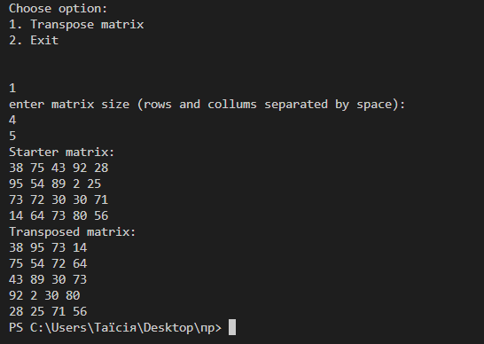

# Практична робота "Поглиблене використання масивів"

## Завдання 9: Транспонувати (замінити рядки стовпцями) матрицю розміром N x M

Calc.java
````java
package main;

import java.util.Random;

/**
 * Клас Calc містить методи для транспонування матриць і генерації випадкових матриць.
 * 
 * @author Таїсія
 */
public class Calc {
    /**
     * Транспонує задану матрицю.
     * 
     * @param matrix Матриця, яку потрібно транспонувати
     * @return Транспонована матриця
     */
    public static int[][] transposeMatrix(int[][] matrix) {
        int rows = matrix.length;
        int columns = matrix[0].length;
        int[][] transposedMatrix = new int[columns][rows];
        
        for (int i = 0; i < rows; i++) {
            for (int j = 0; j < columns; j++) {
                transposedMatrix[j][i] = matrix[i][j];
            }
        }
        
        return transposedMatrix;
    }
    
    /**
     * Генерує випадкову матрицю заданого розміру.
     * 
     * @param rows Кількість рядків у матриці
     * @param columns Кількість стовпців у матриці
     * @return Випадково згенерована матриця
     */
    public static int[][] generateRandomMatrix(int rows, int columns) {
        Random random = new Random();
        int[][] matrix = new int[rows][columns];
        
        for (int i = 0; i < rows; i++) {
            for (int j = 0; j < columns; j++) {
                matrix[i][j] = random.nextInt(100); // Генерує випадкове число від 0 до 99
            }
        }
        
        return matrix;
    }
}

````

Main.java
````java
package main;

    import java.util.Scanner;
/**
 * Клас Main надає просте меню для транспонування випадково згенерованої матриці.
 * Користувачі можуть обрати транспонування матриці або вийти з програми.
 * 
 * @author Таїсія
 */
public class Main {
     /**
     * Головний метод виводить меню та обробляє введення користувача.
     * 
     * @param args Аргументи командного рядка
     */
    public static void main(String[] args) {
        Scanner scanner = new Scanner(System.in);
        
        System.out.println("Choose option:");
        System.out.println("1. Transpose matrix");
        System.out.println("2. Exit");
        
        int option = scanner.nextInt();
        
        switch (option) {
            case 1:
                System.out.println("enter matrix size (rows and collums separated by space):");
                int rows = scanner.nextInt();
                int columns = scanner.nextInt();
                
                int[][] matrix = Calc.generateRandomMatrix(rows, columns);
                
                System.out.println("Starter matrix:");
                printMatrix(matrix);
                
                int[][] transposedMatrix = Calc.transposeMatrix(matrix);
                
                System.out.println("Transposed matrix:");
                printMatrix(transposedMatrix);
                break;
            case 2:
                System.out.println("Bye!");
                break;
            default:
                System.out.println("Unknown option, try again.");
        }
        
        scanner.close();
    }
    
   /**
     * Друкує матрицю на консоль.
     * 
     * @param matrix Матриця, яку потрібно вивести
     */
    public static void printMatrix(int[][] matrix) {
        for (int[] row : matrix) {
            for (int value : row) {
                System.out.print(value + " ");
            }
            System.out.println();
        }
    }
}

````
MainTest.java
````java
package main;

import org.junit.After;
import org.junit.AfterClass;
import org.junit.Before;
import org.junit.BeforeClass;
import org.junit.Test;
import static org.junit.jupiter.api.Assertions.assertArrayEquals;
import static org.junit.jupiter.api.Assertions.assertEquals;

/**
 *
 * @author Таїсія
 * 
 * Клас MainTest містить тести для перевірки працездатності класів Main і Calc.
*/ 
public class MainTest {
    
    public MainTest() {
    }
    
    @BeforeClass
    public static void setUpClass() {
    }
    
    @AfterClass
    public static void tearDownClass() {
    }
    
    @Before
    public void setUp() {
    }
    
    @After
    public void tearDown() {
    }
    
     /**
     * Перевірка транспонування матриці.
     */
    @Test
    public void testTestTransposeMatrix() {
        int[][] originalMatrix = {{1, 2, 3}, {4, 5, 6}, {7, 8, 9}};
        int[][] expectedTransposedMatrix = {{1, 4, 7}, {2, 5, 8}, {3, 6, 9}};
        
        int[][] transposedMatrix = Calc.transposeMatrix(originalMatrix);
        
        assertArrayEquals(expectedTransposedMatrix, transposedMatrix);
    }
    
     /**
     * Перевірка генерації випадкової матриці.
     */
    @Test
    public void testTestGenerateRandomMatrix() {
        int rows = 3;
        int columns = 4;
        
        int[][] randomMatrix = Calc.generateRandomMatrix(rows, columns);
        
        assertEquals(rows, randomMatrix.length);
        assertEquals(columns, randomMatrix[0].length);
    }
    
}

````

## Результат:


